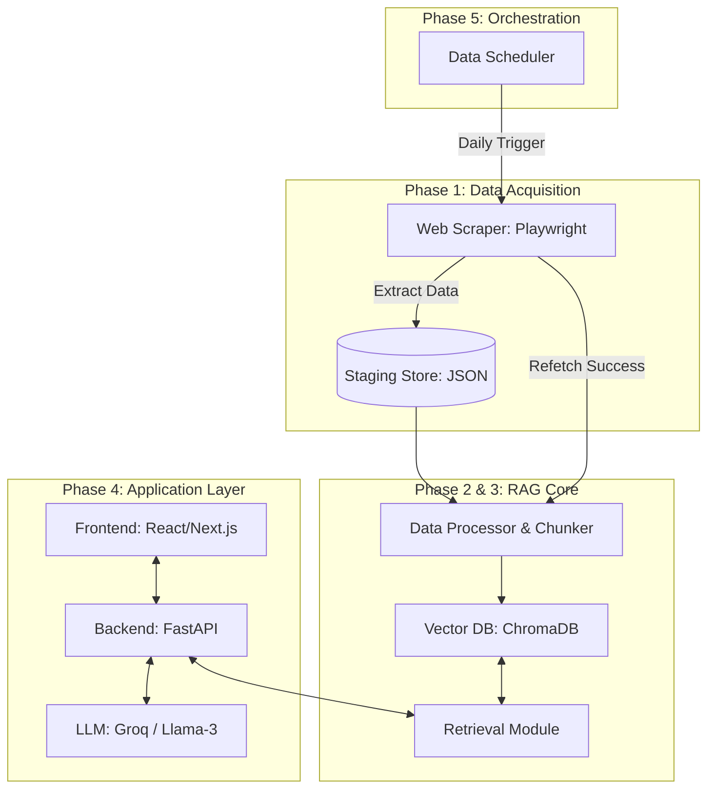

# RAG Mutual Fund FAQ Chatbot Architecture

This document outlines the end-to-end architecture of the RAG-based chatbot designed for Mutual Fund FAQs.

## System Architecture

## Phases Overview

### Phase 1: Data Acquisition
- **Technology**: Python, Playwright.
- **Workflow**: Scrapes fund details from `indmoney.com`.
- **Metrics**: Expense Ratio, Exit Load, NAV, AUM, Min SIP, Lock-in, Risk, **Fund Manager**, and **Returns (1Y, 3Y, 5Y)**.
- **Output**: `data/funds.json`.

### Phase 2: Knowledge Base Indexing
- **Technology**: ChromaDB / Persistent Vector Store.
- **Workflow**: Chunks the JSON data and generates embeddings for semantic retrieval.

### Phase 3: RAG Chatbot Logic
- **LLM Engine**: **Groq** (using Llama-3 or similar).
- **Strict Policies**:
    - **RAG-Only**: The bot must NOT answer using its internal training data; it only uses retrieved embeddings.
    - **Out of Scope**: Rejects any personal information (PII) or account-specific questions as out of scope.
    - **No Advice**: Rebuffs "should I buy" or recommendation queries.
    - **Transparency**: Mandatory source links and "Last updated" footer.

### Phase 4: Full-Stack Application
- **Backend**: FastAPI for high-performance API endpoints.
- **Frontend**: Modern, responsive glassmorphic UI.

### Phase 5: Autonomous Scheduler
- **Technology**: GitHub Actions or APScheduler.
- **Workflow**: Automatically runs the Phase 1 scraper to ensure data freshness and triggers RAG re-indexing.

---
*Last Updated: March 3, 2026*
